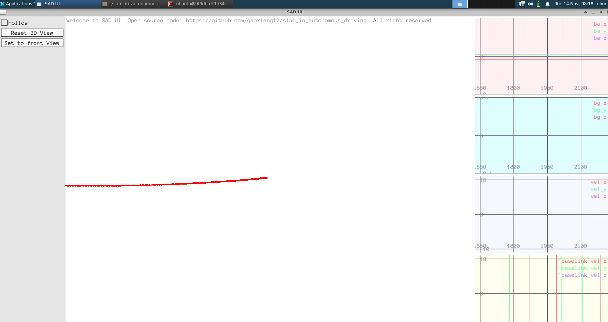
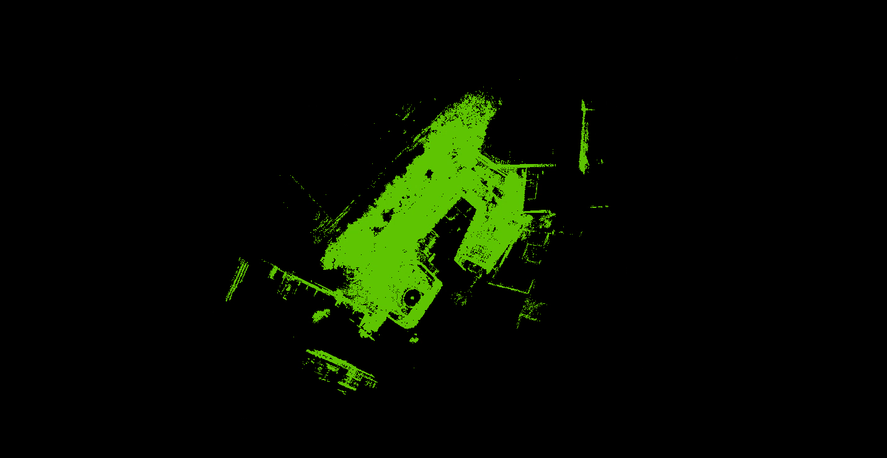

# 写在前面

仓库代码运行，课后习题实现，代码运行注释

https://github.com/haohaoalt/slam_in_autonomous_driving.git branch：hayden

环境依赖建议使用docker：docker pull haohaoalt/u20_cuda:1108

# ch01 自动驾驶

None

# ch02 基础数学知识回顾

## 01 motion.cc

参考链接：https://zhuanlan.zhihu.com/p/631969605

```
ubuntu@9f9dbfdc1d34:~/Dev/docker/u20_cuda/slam_in_autonomous_driving$ ./bin/motion
```


## 02 motion_hw.cpp

```
ubuntu@9f9dbfdc1d34:~/Dev/docker/u20_cuda/slam_in_autonomous_driving$ ./bin/motion_hw
```


# ch03 惯性导航与组合导航

## 01 run_imu_intergration.cc

```
ubuntu@9f9dbfdc1d34:~/Dev/docker/u20_cuda/slam_in_autonomous_driving$ ./bin/run_imu_integration
```



```
ubuntu@9f9dbfdc1d34:~/Dev/docker/u20_cuda/slam_in_autonomous_driving$ python3 scripts/plot_ch3_state.py data/ch3/state.txt 
```


## 02 process_gnss.cc

```
ubuntu@9f9dbfdc1d34:~/Dev/docker/u20_cuda/slam_in_autonomous_driving$ ./bin/process_gnss 
```


```
ubuntu@9f9dbfdc1d34:~/Dev/docker/u20_cuda/slam_in_autonomous_driving$ python3 scripts/plot_ch3_gnss_2d.py ./data/ch3/gnss_output.txt 
ubuntu@9f9dbfdc1d34:~/Dev/docker/u20_cuda/slam_in_autonomous_driving$ python3 scripts/plot_ch3_gnss_3d.py ./data/ch3/gnss_output.txt 
```


## 03 run_eskf_gins.cc

```
ubuntu@9f9dbfdc1d34:~/Dev/docker/u20_cuda/slam_in_autonomous_driving$ ./bin/run_eskf_gins
```


```
ubuntu@9f9dbfdc1d34:~/Dev/docker/u20_cuda/slam_in_autonomous_driving$ ./bin/run_eskf_gins --with_odom=true
```


# ch4预积分学
## 01 gins_pre_integ.cc
```
ubuntu@9f9dbfdc1d34:~/Dev/docker/u20_cuda/slam_in_autonomous_driving$ ./bin/run_gins_pre_integ
```


## 02 plot_ch3_state.py
```
ubuntu@9f9dbfdc1d34:~/Dev/docker/u20_cuda/slam_in_autonomous_driving$ python3 scripts/plot_ch3_state.py ./data/ch4/gins_preintg.txt
```


# ch5 基础点云处理

## 01 map_example
```bash
ubuntu@9f9dbfdc1d34:~/Dev/docker/u20_cuda/slam_in_autonomous_driving$ pcl_viewer ./data/ch5/map_example.pcd 
```

## 02 point_cloud_load_and_vis
```
ubuntu@9f9dbfdc1d34:~/Dev/docker/u20_cuda/slam_in_autonomous_driving$ ./bin/point_cloud_load_and_vis
```


## 03 pcd_to_brid_eye
```
ubuntu@9f9dbfdc1d34:~/Dev/docker/u20_cuda/slam_in_autonomous_driving$ ./bin/pcd_to_bird_eye 
```


## 04 scan_to_range_image
```
ubuntu@9f9dbfdc1d34:~/Dev/docker/u20_cuda/slam_in_autonomous_driving$ ./bin/scan_to_range_image
```


## 05 test_nn
```
ubuntu@9f9dbfdc1d34:~/Dev/docker/u20_cuda/slam_in_autonomous_driving$ ./bin/test_nn 
```


## 06 linear_fitting
```
ubuntu@9f9dbfdc1d34:~/Dev/docker/u20_cuda/slam_in_autonomous_driving$  ./bin/linear_fitting
```

# ch6 2D SLAM
## 01 

```
ubuntu@9f9dbfdc1d34:~/Dev/docker/u20_cuda/slam_in_autonomous_driving$ ./bin/test_2dlidar_io --bag_path ../../../Dataset/sad/2dmapping/floor1.bag
ubuntu@9f9dbfdc1d34:~/Dev/Dataset/sad/2dmapping$ rosbag info floor1.bag 
path:        floor1.bag
version:     2.0
duration:    10:14s (614s)
start:       May 19 2021 12:05:58.18 (1621425958.18)
end:         May 19 2021 12:16:13.13 (1621426573.13)
size:        140.7 MB
messages:    136217
compression: none [185/185 chunks]
types:       canbus_msgs/CanSensor      [97a1b91c1424e5bb5793a2e56f926571]
             locsensor/ivsensorimu      [7a70bbde04729b59a0a4a83290e4d765]
             scrubber_slam/localization [8a732186247a791ef4f87104979ca927]
             sensor_msgs/LaserScan      [90c7ef2dc6895d81024acba2ac42f369]
topics:      /ivsensorimu           61784 msgs    : locsensor/ivsensorimu     
             /marker/localization   61782 msgs    : scrubber_slam/localization
             /pavo_scan_bottom       6501 msgs    : sensor_msgs/LaserScan     
             /tpcansensor            6150 msgs    : canbus_msgs/CanSensor
```


## 02 test_2d_icp_s2s
```
ubuntu@9f9dbfdc1d34:~/Dev/docker/u20_cuda/slam_in_autonomous_driving$ ./bin/test_2d_icp_s2s --bag_path ../../../Dataset/sad/2dmapping/floor1.bag
ubuntu@9f9dbfdc1d34:~/Dev/docker/u20_cuda/slam_in_autonomous_driving$ ./bin/test_2d_icp_s2s -method=point2plane --bag_path ../../../Dataset/sad/2dmapping/floor1.bag
```


## 03 test_2d_icp_likelihood
```
ubuntu@9f9dbfdc1d34:~/Dev/docker/u20_cuda/slam_in_autonomous_driving$ ./bin/test_2d_icp_likelihood --bag_path ../../../Dataset/sad/2dmapping/floor1.bag
```


## 04 test_occupy_grid


## 05 test_2d_mapping
```
ubuntu@9f9dbfdc1d34:~/Dev/docker/u20_cuda/slam_in_autonomous_driving$ ./bin/test_2d_mapping --bag_path ../../../Dataset/sad/2dmapping/floor1.bag
```


## 06 test_2d_mapping with loop
```
ubuntu@9f9dbfdc1d34:~/Dev/docker/u20_cuda/slam_in_autonomous_driving$ ./bin/test_2d_mapping -with_loop_closing=true --bag_path ../../../Dataset/sad/2dmapping/floor1.bag
```


# ch7 3D SLAM
## 01  test_icp
```
ubuntu@9f9dbfdc1d34:~/Dev/docker/u20_cuda/slam_in_autonomous_driving$ ./bin/test_icp 

```


## 02 pcl_viewer
```
ubuntu@9f9dbfdc1d34:~/Dev/docker/u20_cuda/slam_in_autonomous_driving$ pcl_viewer ./data/ch7/icp_trans.pcd ./data/ch7/EPFL/kneeling_lady_target.pcd 
```


# ch8 紧耦合LIO系统

# ch9 自动驾驶车辆的离线地图构建

# ch10 自动驾驶车辆的的实时定位系统

